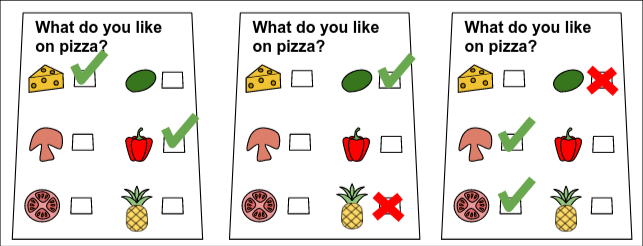
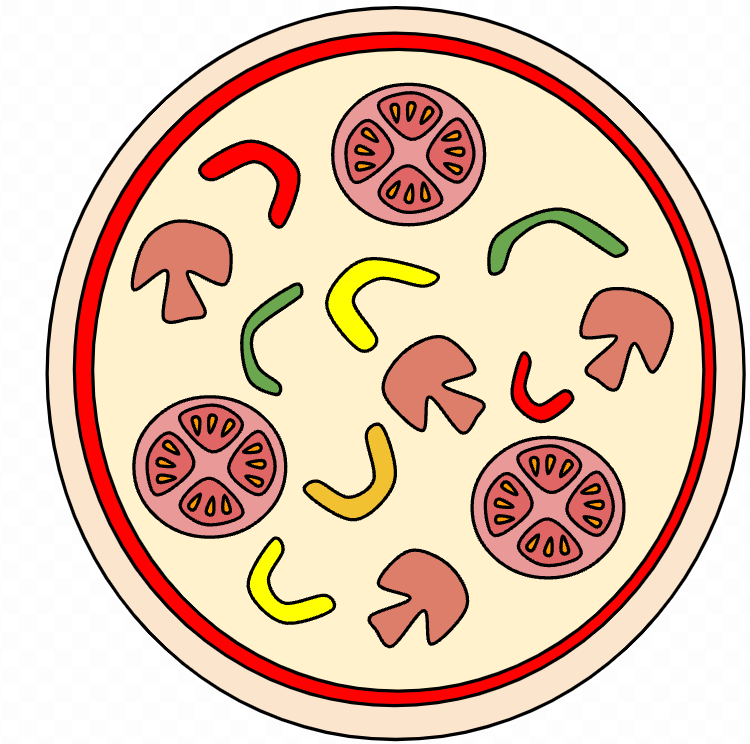

## Problem

 


You are opening a small pizzeria. In fact, your pizzeria is **so** small that you decided to offer only **one type of pizza**. Now you need to decide what ingredients to include (peppers? tomatoes? both?).

Everyone has their own pizza preferences. Each of your potential clients has some ingredients they like, and maybe some ingredients they dislike. Each client will come to your pizzeria if both conditions are true:

1. ​    **all** the ingredients they like are on the pizza, and  
2. ​    **none** of the ingredients they dislike are on the pizza  

Each client is OK with additional ingredients they neither like or dislike being present on the pizza. Your task is to choose which ingredients to put on your only pizza type, to maximize the number of clients that will visit your pizzeria.

### Input

- The first line contains one integer  `1 ≤ C ≤ 10⁵` - the number of potential clients.  
- The following `2 × C`  lines describe the clients’ preferences in the following format:
  - First line contains integer `1 ≤ L ≤ 5`, followed by `L` names of ingredients a client likes, delimited by spaces.
  - Second line contains integer `0 ≤ D ≤ 5`, followed by `D` names of ingredients a client dislikes, delimited by spaces.

Each ingredient name consists of between 1 and 15 ASCII characters.  Each character is one of the lowercase letters (a-z) or a digit (0-9).

### Submission

The submission should consist of one line consisting of a single number 0≤N followed by a  list of N ingredients to put on the only pizza available in the pizzeria, separated by spaces.  The list of ingredients should contain only the ingredients mentioned by at least one client,  without duplicates.

### Scoring

A solution scores one point for each client that will come to your pizzeria. A client will come to your pizzeria if **all the ingredients they like** are on the pizza and **none of the ingredients they dislike** are on the pizza.

### Sample

Sample Input

```
3
2 cheese peppers
0
1 basil
1 pineapple
2 mushrooms tomatoes
1 basil
```

Sample Output

```
4 cheese mushrooms tomatoes peppers
```

In the Sample Input there are `3` potential clients:

-   The first client likes `2` ingredients, `cheese` and `peppers`,  and does not dislike anything.

-   The second client likes only `basil` and dislikes only `pineapple`.
-   The third client likes `mushrooms` and `tomatoes` and dislikes only  `basil`

 The picture below shows the preferences of `3` potential clients.



  In this particular Sample Output, we choose to use `4` ingredients in the pizza:  `cheese`, `mushrooms`, `tomatoes`, and `peppers`.



-   The first client likes the pizza because it contains both `cheese` and  `peppers`, which they like.
-   The second client does not like the pizza: it does not contain `basil` which they like.
-   The third client likes the pizza because it contains `mushrooms` and  `tomatoes`, which they like, and does not contain `basil` which they do not  like.

This means a submission of this output would score `2` points for this case, because two  clients (the first and third ones) would like this pizza.